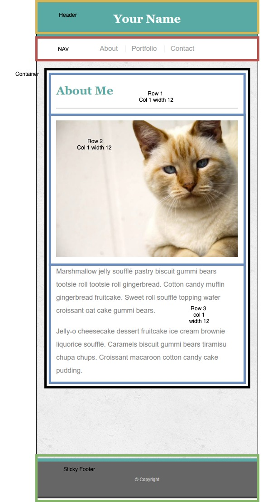
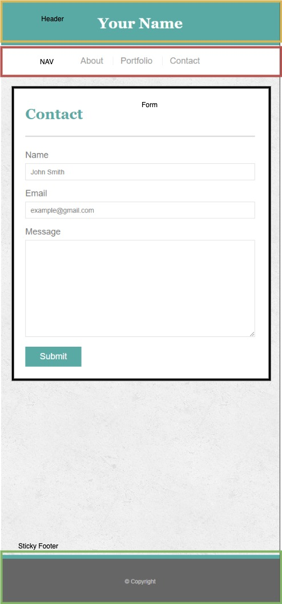
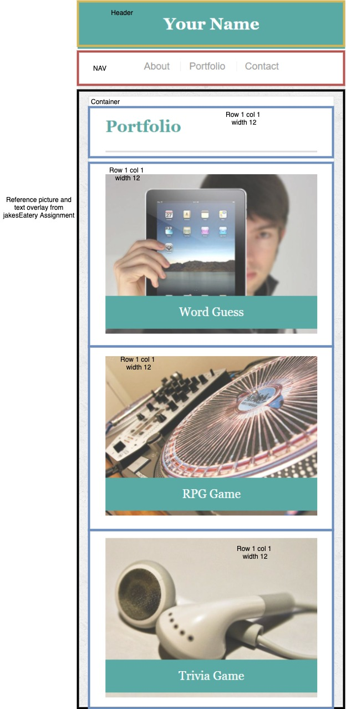

# AshleyLerma.github.io

The homework for week 2 was to create a portfolio including a home, contact and portfolio page.

Minimum Requirements

- Functional, deployed application
- GitHub repository with README describing the project
- Navbar must be consistent on each page.
- Navbar on each page must contain links to Home/About, Contact, and Portfolio pages.
- All links must work.
- Must use semantic html.
- Each page must have valid and correct HTML. (use a validation service)
- Must contain your personalized information. (bio, name, images, links to social media, etc.)
- Must properly utilize Bootstrap components and grid system.
- Must have 100 commits
- Must be a responsive web page with responsive images

Below are the preliminary ideas for how to break down each page but changes were made as needed.

